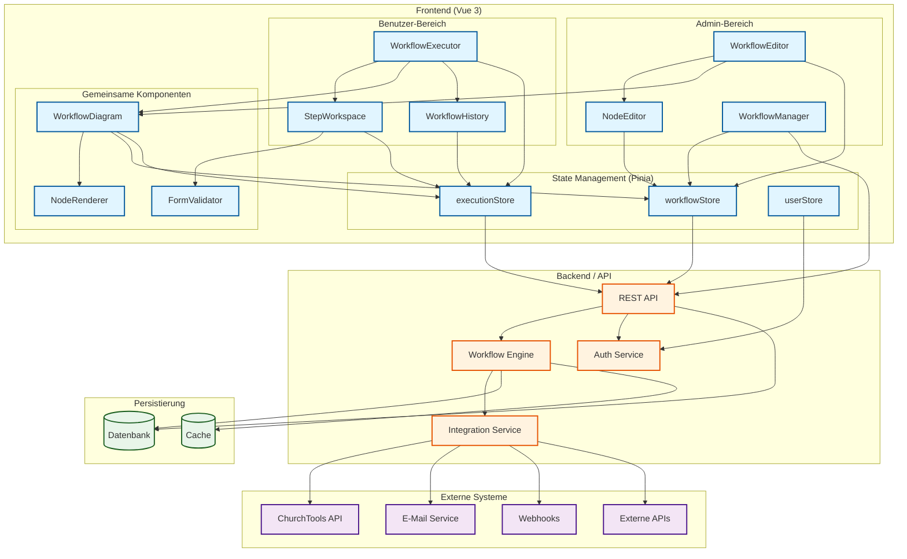
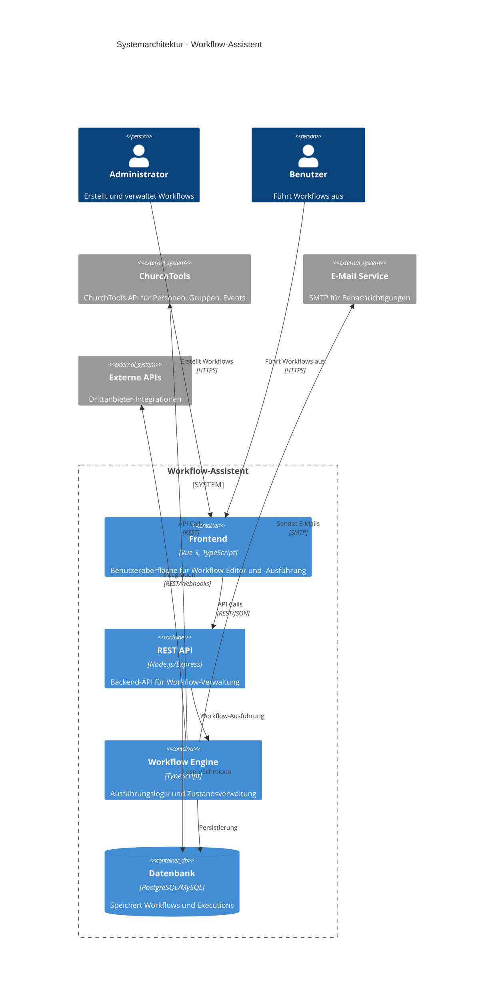
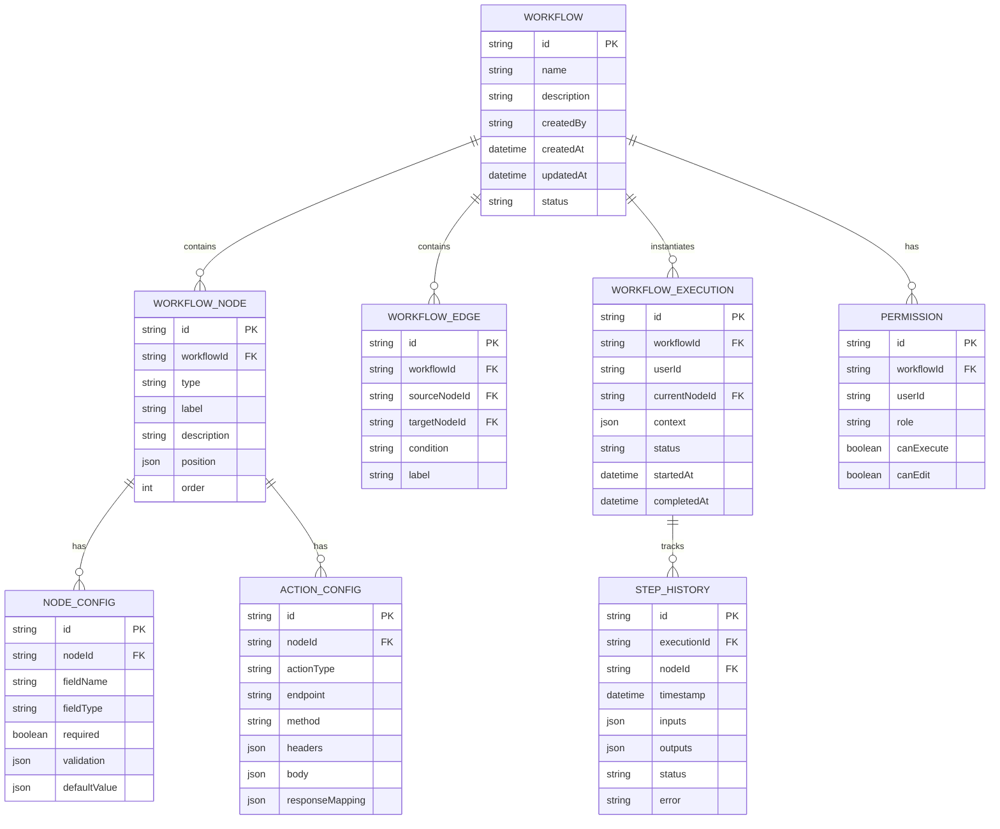
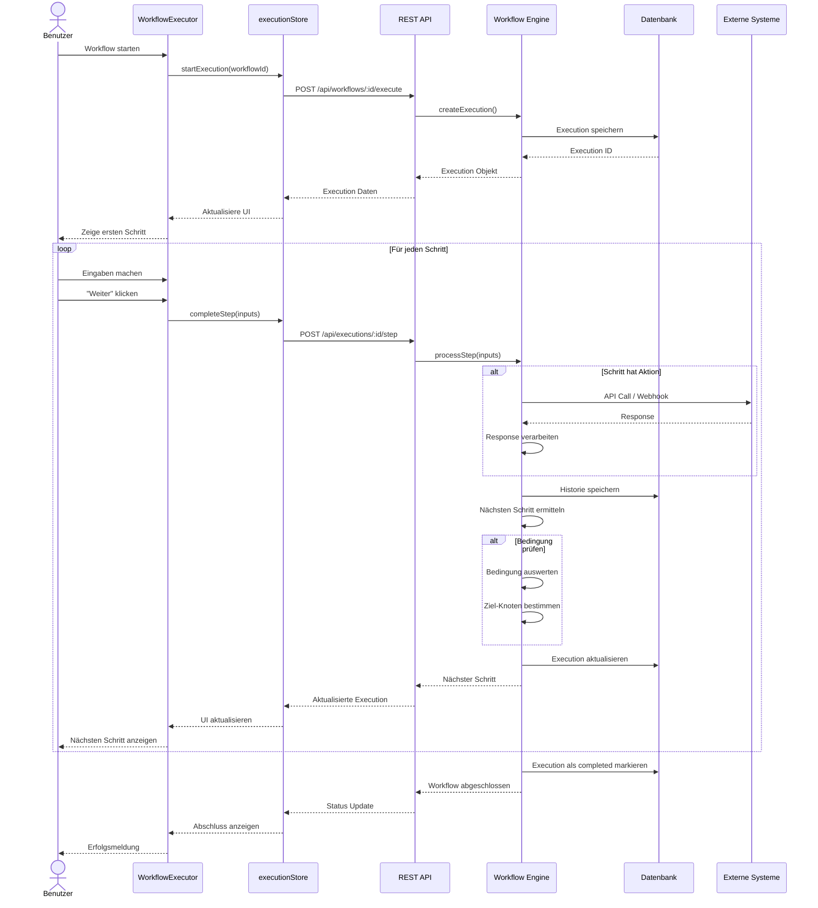
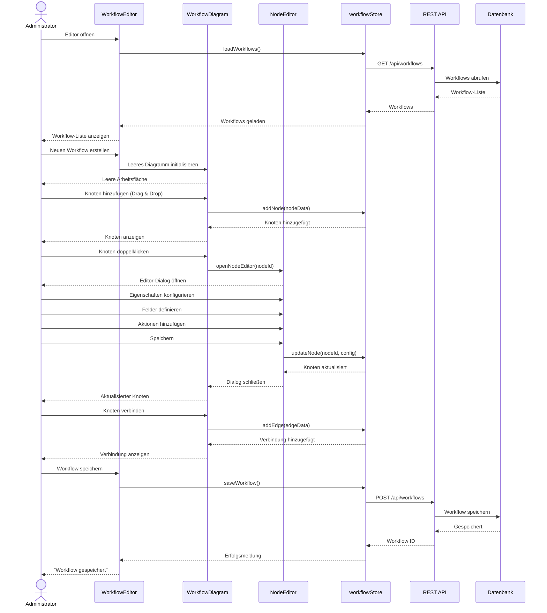
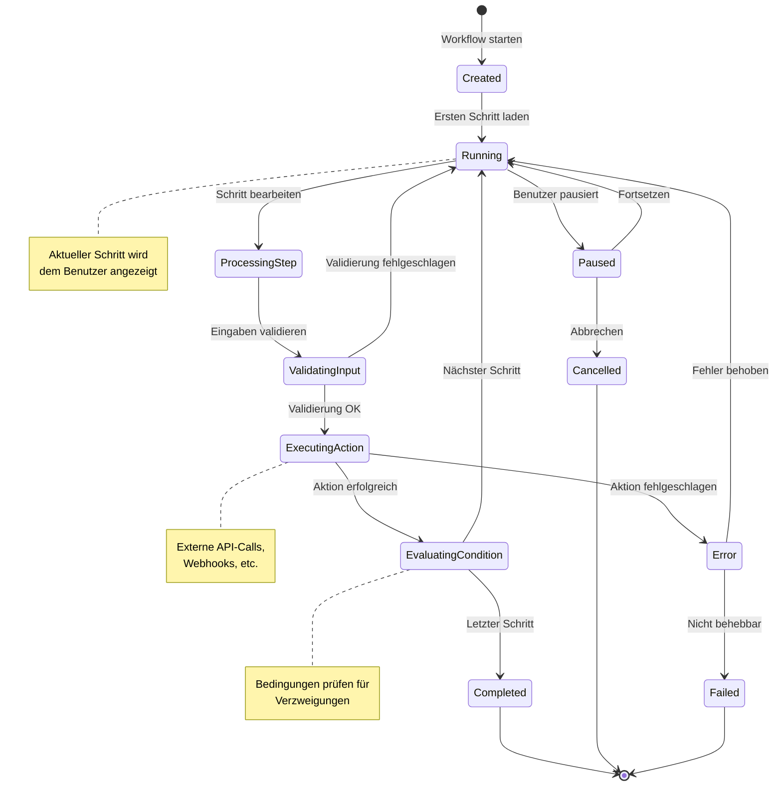
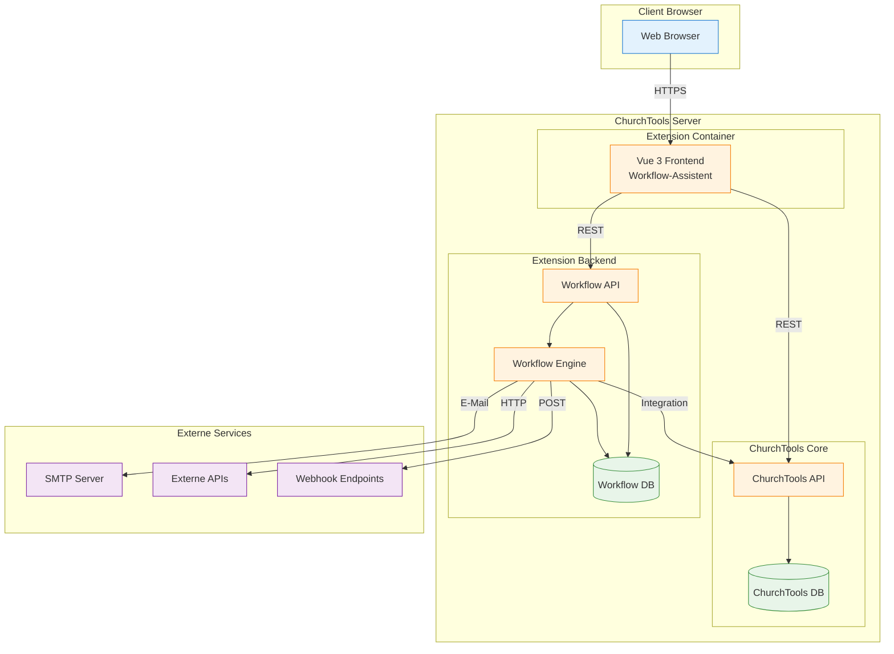
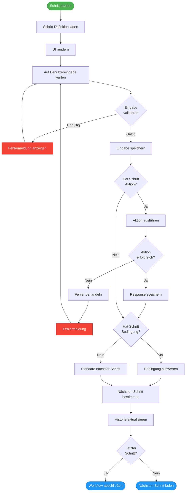
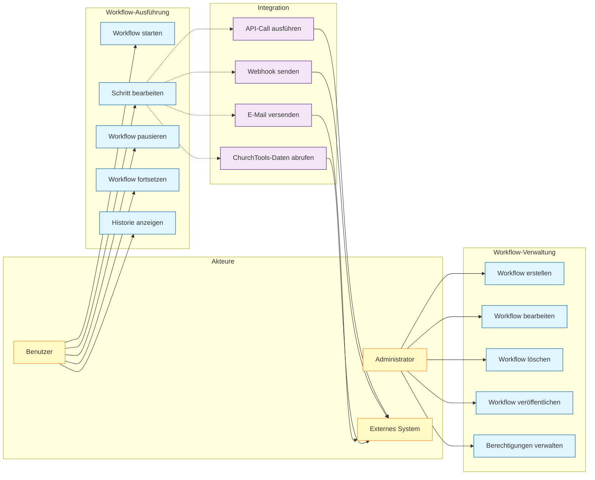

# Workflow-Assistent - Diagramme

## 1. Komponentendiagramm



## 2. Systemarchitektur



## 3. Datenmodell



## 4. Workflow-Ausführung Sequenzdiagramm



## 5. Workflow-Editor Sequenzdiagramm



## 6. Zustandsdiagramm - Workflow-Execution



## 7. Deployment-Diagramm



## 8. Aktivitätsdiagramm - Workflow-Schritt mit Verzweigung



## 9. Use Case Diagramm



## 10. Klassendiagramm - Core Entities

```mermaid
classDiagram
    class Workflow {
        +string id
        +string name
        +string description
        +WorkflowNode[] nodes
        +WorkflowEdge[] edges
        +Permission[] permissions
        +Date createdAt
        +Date updatedAt
        +addNode(node: WorkflowNode)
        +removeNode(nodeId: string)
        +addEdge(edge: WorkflowEdge)
        +removeEdge(edgeId: string)
        +validate() bool
    }
    
    class WorkflowNode {
        +string id
        +NodeType type
        +string label
        +string description
        +Position position
        +NodeConfig config
        +ActionConfig[] actions
        +validate() bool
        +execute(context: Context) Result
    }
    
    class WorkflowEdge {
        +string id
        +string sourceId
        +string targetId
        +string condition
        +string label
        +evaluate(context: Context) bool
    }
    
    class WorkflowExecution {
        +string id
        +string workflowId
        +string userId
        +string currentNodeId
        +Context context
        +StepHistory[] history
        +ExecutionStatus status
        +Date startedAt
        +Date completedAt
        +start()
        +processStep(inputs: any)
        +pause()
        +resume()
        +cancel()
    }
    
    class Context {
        +Map~string, any~ variables
        +string userId
        +Date timestamp
        +get(key: string) any
        +set(key: string, value: any)
        +merge(data: object)
    }
    
    class StepHistory {
        +string id
        +string nodeId
        +Date timestamp
        +object inputs
        +object outputs
        +StepStatus status
        +string error
    }
    
    class NodeConfig {
        +FormField[] fields
        +ValidationRule[] validations
        +object defaultValues
        +validate(inputs: any) bool
    }
    
    class ActionConfig {
        +ActionType type
        +string endpoint
        +HttpMethod method
        +object headers
        +object body
        +ResponseMapping responseMapping
        +execute(context: Context) Response
    }
    
    class Permission {
        +string userId
        +Role role
        +bool canExecute
        +bool canEdit
        +bool canDelete
    }
    
    <<enumeration>> NodeType {
        START
        TASK
        DECISION
        ACTION
        END
    }
    
    <<enumeration>> ExecutionStatus {
        CREATED
        RUNNING
        PAUSED
        COMPLETED
        FAILED
        CANCELLED
    }
    
    <<enumeration>> StepStatus {
        SUCCESS
        ERROR
        SKIPPED
    }
    
    <<enumeration>> ActionType {
        REST_API
        WEBHOOK
        EMAIL
        CHURCHTOOLS_API
    }
    
    Workflow "1" --> "*" WorkflowNode
    Workflow "1" --> "*" WorkflowEdge
    Workflow "1" --> "*" Permission
    Workflow "1" --> "*" WorkflowExecution
    
    WorkflowNode "1" --> "1" NodeConfig
    WorkflowNode "1" --> "*" ActionConfig
    
    WorkflowExecution "1" --> "1" Context
    WorkflowExecution "1" --> "*" StepHistory
    
    WorkflowEdge --> WorkflowNode : source
    WorkflowEdge --> WorkflowNode : target
```
