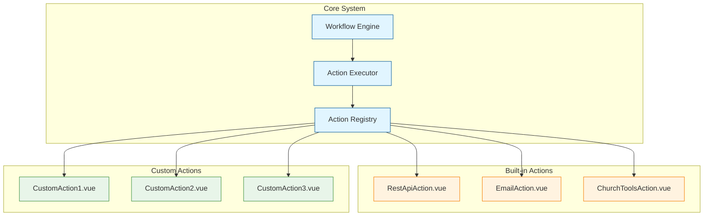

# Plugin-System für Aktions-Knoten

## Übersicht

Das Plugin-System ermöglicht Entwicklern, eigene Aktions-Knoten als Vue-Komponenten zu erstellen und einfach in den Workflow-Assistenten zu integrieren.

## Konzept

### Ziele
- **Einfache Erweiterbarkeit:** Neue Aktionen mit minimaler Konfiguration hinzufügen
- **Typsicherheit:** Vollständige TypeScript-Unterstützung
- **Wiederverwendbarkeit:** Aktionen können in mehreren Workflows genutzt werden
- **Isolation:** Jede Aktion ist eine eigenständige Komponente
- **Konfigurierbarkeit:** Aktionen können über Props konfiguriert werden

### Architektur



## Implementierung

### 1. Base Action Interface

```typescript
// types/action-plugin.types.ts

import type { Component } from 'vue';

/**
 * Base interface für alle Action Plugins
 */
export interface ActionPlugin {
  /** Eindeutiger Identifier */
  id: string;
  
  /** Anzeigename */
  name: string;
  
  /** Beschreibung der Aktion */
  description: string;
  
  /** Icon (optional) */
  icon?: string;
  
  /** Kategorie für Gruppierung */
  category: ActionCategory;
  
  /** Vue-Komponente für Konfiguration im Editor */
  configComponent: Component;
  
  /** Vue-Komponente für Ausführung */
  executeComponent?: Component;
  
  /** Validierungsfunktion für Konfiguration */
  validate?: (config: any) => ValidationResult;
  
  /** Standard-Konfiguration */
  defaultConfig: Record<string, any>;
  
  /** Schema für Konfiguration (JSON Schema) */
  configSchema?: object;
}

/**
 * Kontext der an Action-Komponenten übergeben wird
 */
export interface ActionContext {
  /** Workflow-Kontext mit allen Variablen */
  workflowContext: Record<string, any>;
  
  /** Aktuelle Execution ID */
  executionId: string;
  
  /** Node ID */
  nodeId: string;
  
  /** Benutzer ID */
  userId: string;
  
  /** Hilfsfunktionen */
  helpers: {
    /** Variable aus Kontext abrufen */
    getVariable: (key: string) => any;
    
    /** Variable setzen */
    setVariable: (key: string, value: any) => void;
    
    /** HTTP Request ausführen */
    http: HttpClient;
    
    /** ChurchTools API */
    churchtools: ChurchToolsClient;
  };
}

/**
 * Rückgabewert einer Action-Ausführung
 */
export interface ActionResult {
  /** Erfolgreich? */
  success: boolean;
  
  /** Ausgabedaten */
  data?: any;
  
  /** Fehlermeldung */
  error?: string;
  
  /** Zusätzliche Metadaten */
  metadata?: Record<string, any>;
}

export enum ActionCategory {
  INTEGRATION = 'integration',
  COMMUNICATION = 'communication',
  DATA = 'data',
  LOGIC = 'logic',
  CUSTOM = 'custom'
}

export interface ValidationResult {
  valid: boolean;
  errors?: string[];
}
```

### 2. Action Registry

```typescript
// services/ActionRegistry.ts

import type { ActionPlugin } from '@/types/action-plugin.types';

class ActionRegistry {
  private actions: Map<string, ActionPlugin> = new Map();

  /**
   * Registriert eine neue Action
   */
  register(action: ActionPlugin): void {
    if (this.actions.has(action.id)) {
      console.warn(`Action ${action.id} already registered, overwriting`);
    }
    
    this.actions.set(action.id, action);
    console.log(`Registered action: ${action.id}`);
  }

  /**
   * Registriert mehrere Actions
   */
  registerMany(actions: ActionPlugin[]): void {
    actions.forEach(action => this.register(action));
  }

  /**
   * Gibt eine Action zurück
   */
  get(id: string): ActionPlugin | undefined {
    return this.actions.get(id);
  }

  /**
   * Gibt alle Actions zurück
   */
  getAll(): ActionPlugin[] {
    return Array.from(this.actions.values());
  }

  /**
   * Gibt Actions nach Kategorie zurück
   */
  getByCategory(category: ActionCategory): ActionPlugin[] {
    return this.getAll().filter(action => action.category === category);
  }

  /**
   * Prüft ob Action existiert
   */
  has(id: string): boolean {
    return this.actions.has(id);
  }

  /**
   * Entfernt eine Action
   */
  unregister(id: string): boolean {
    return this.actions.delete(id);
  }

  /**
   * Entfernt alle Actions
   */
  clear(): void {
    this.actions.clear();
  }
}

// Singleton Instance
export const actionRegistry = new ActionRegistry();
```

### 3. Action Base Component

```typescript
// components/actions/BaseAction.vue

<script setup lang="ts">
import { computed } from 'vue';
import type { ActionContext, ActionResult } from '@/types/action-plugin.types';

interface Props {
  /** Konfiguration der Action */
  config: Record<string, any>;
  
  /** Action Context */
  context: ActionContext;
  
  /** Nur Konfiguration anzeigen (Editor-Modus) */
  configMode?: boolean;
}

interface Emits {
  /** Wird aufgerufen wenn Action abgeschlossen ist */
  (e: 'complete', result: ActionResult): void;
  
  /** Wird aufgerufen wenn Konfiguration geändert wird */
  (e: 'update:config', config: Record<string, any>): void;
}

const props = defineProps<Props>();
const emit = defineEmits<Emits>();

/**
 * Hilfsfunktion zum Ausführen der Action
 */
const executeAction = async (handler: () => Promise<ActionResult>) => {
  try {
    const result = await handler();
    emit('complete', result);
  } catch (error) {
    emit('complete', {
      success: false,
      error: error.message
    });
  }
};

/**
 * Hilfsfunktion zum Aktualisieren der Config
 */
const updateConfig = (updates: Record<string, any>) => {
  emit('update:config', { ...props.config, ...updates });
};

// Expose für Child-Komponenten
defineExpose({
  executeAction,
  updateConfig
});
</script>
```

### 4. Beispiel: REST API Action

```typescript
// actions/rest-api/RestApiAction.ts

import { defineAsyncComponent } from 'vue';
import type { ActionPlugin } from '@/types/action-plugin.types';
import { ActionCategory } from '@/types/action-plugin.types';

export const RestApiAction: ActionPlugin = {
  id: 'rest-api',
  name: 'REST API Call',
  description: 'Führt einen HTTP Request zu einer externen API aus',
  icon: 'globe',
  category: ActionCategory.INTEGRATION,
  
  configComponent: defineAsyncComponent(
    () => import('./RestApiConfig.vue')
  ),
  
  executeComponent: defineAsyncComponent(
    () => import('./RestApiExecute.vue')
  ),
  
  defaultConfig: {
    method: 'GET',
    url: '',
    headers: {},
    body: null,
    timeout: 30000,
    responseMapping: {}
  },
  
  validate: (config) => {
    const errors: string[] = [];
    
    if (!config.url) {
      errors.push('URL ist erforderlich');
    }
    
    if (!['GET', 'POST', 'PUT', 'DELETE', 'PATCH'].includes(config.method)) {
      errors.push('Ungültige HTTP-Methode');
    }
    
    return {
      valid: errors.length === 0,
      errors
    };
  },
  
  configSchema: {
    type: 'object',
    properties: {
      method: {
        type: 'string',
        enum: ['GET', 'POST', 'PUT', 'DELETE', 'PATCH']
      },
      url: {
        type: 'string',
        format: 'uri'
      },
      headers: {
        type: 'object'
      },
      body: {
        type: ['object', 'null']
      },
      timeout: {
        type: 'number',
        minimum: 1000,
        maximum: 300000
      }
    },
    required: ['method', 'url']
  }
};
```

```vue
<!-- actions/rest-api/RestApiConfig.vue -->

<script setup lang="ts">
import { ref, computed } from 'vue';
import type { ActionContext } from '@/types/action-plugin.types';

interface Props {
  config: {
    method: string;
    url: string;
    headers: Record<string, string>;
    body: any;
    timeout: number;
    responseMapping: Record<string, string>;
  };
  context: ActionContext;
}

interface Emits {
  (e: 'update:config', config: any): void;
}

const props = defineProps<Props>();
const emit = defineEmits<Emits>();

const localConfig = ref({ ...props.config });

const updateConfig = () => {
  emit('update:config', localConfig.value);
};

const availableVariables = computed(() => {
  return Object.keys(props.context.workflowContext);
});

const addHeader = () => {
  localConfig.value.headers = {
    ...localConfig.value.headers,
    '': ''
  };
};

const removeHeader = (key: string) => {
  const { [key]: _, ...rest } = localConfig.value.headers;
  localConfig.value.headers = rest;
  updateConfig();
};
</script>

<template>
  <div class="rest-api-config">
    <div class="ct-form-group">
      <label class="ct-form-label">HTTP-Methode</label>
      <select 
        v-model="localConfig.method" 
        class="ct-form-control"
        @change="updateConfig"
      >
        <option value="GET">GET</option>
        <option value="POST">POST</option>
        <option value="PUT">PUT</option>
        <option value="DELETE">DELETE</option>
        <option value="PATCH">PATCH</option>
      </select>
    </div>

    <div class="ct-form-group">
      <label class="ct-form-label">URL</label>
      <input 
        v-model="localConfig.url" 
        type="text" 
        class="ct-form-control"
        placeholder="https://api.example.com/endpoint"
        @blur="updateConfig"
      />
      <small class="ct-form-text">
        Variablen: {{ availableVariables.join(', ') }}
      </small>
    </div>

    <div class="ct-form-group">
      <label class="ct-form-label">Headers</label>
      <div 
        v-for="(value, key) in localConfig.headers" 
        :key="key"
        class="header-row"
      >
        <input 
          :value="key"
          type="text" 
          class="ct-form-control"
          placeholder="Header Name"
          @input="(e) => {
            const newKey = e.target.value;
            const { [key]: val, ...rest } = localConfig.headers;
            localConfig.headers = { ...rest, [newKey]: val };
            updateConfig();
          }"
        />
        <input 
          v-model="localConfig.headers[key]"
          type="text" 
          class="ct-form-control"
          placeholder="Header Value"
          @blur="updateConfig"
        />
        <button 
          type="button"
          class="ct-btn ct-btn-secondary"
          @click="removeHeader(key)"
        >
          ✕
        </button>
      </div>
      <button 
        type="button"
        class="ct-btn ct-btn-secondary"
        @click="addHeader"
      >
        + Header hinzufügen
      </button>
    </div>

    <div v-if="['POST', 'PUT', 'PATCH'].includes(localConfig.method)" class="ct-form-group">
      <label class="ct-form-label">Request Body (JSON)</label>
      <textarea 
        v-model="localConfig.body"
        class="ct-form-control"
        rows="6"
        placeholder='{ "key": "value" }'
        @blur="updateConfig"
      />
    </div>

    <div class="ct-form-group">
      <label class="ct-form-label">Timeout (ms)</label>
      <input 
        v-model.number="localConfig.timeout"
        type="number" 
        class="ct-form-control"
        min="1000"
        max="300000"
        @blur="updateConfig"
      />
    </div>

    <div class="ct-form-group">
      <label class="ct-form-label">Response Mapping</label>
      <small class="ct-form-text">
        Mappe Response-Felder auf Workflow-Variablen
      </small>
      <div class="mapping-info">
        <code>response.data.id → userId</code>
      </div>
    </div>
  </div>
</template>

<style scoped>
.rest-api-config {
  padding: 1rem;
}

.header-row {
  display: flex;
  gap: 0.5rem;
  margin-bottom: 0.5rem;
}

.header-row input {
  flex: 1;
}

.header-row button {
  width: 40px;
}

.mapping-info {
  padding: 0.5rem;
  background: var(--ct-secondary);
  border-radius: 4px;
  margin-top: 0.5rem;
}
</style>
```

```vue
<!-- actions/rest-api/RestApiExecute.vue -->

<script setup lang="ts">
import { ref, onMounted } from 'vue';
import type { ActionContext, ActionResult } from '@/types/action-plugin.types';

interface Props {
  config: {
    method: string;
    url: string;
    headers: Record<string, string>;
    body: any;
    timeout: number;
  };
  context: ActionContext;
}

interface Emits {
  (e: 'complete', result: ActionResult): void;
}

const props = defineProps<Props>();
const emit = defineEmits<Emits>();

const loading = ref(false);
const status = ref<'pending' | 'success' | 'error'>('pending');
const message = ref('');

const replaceVariables = (str: string): string => {
  return str.replace(/\{\{(\w+)\}\}/g, (_, key) => {
    return props.context.helpers.getVariable(key) || '';
  });
};

const executeRequest = async () => {
  loading.value = true;
  status.value = 'pending';
  message.value = 'Führe API-Request aus...';

  try {
    const url = replaceVariables(props.config.url);
    
    const response = await props.context.helpers.http.request({
      method: props.config.method,
      url,
      headers: props.config.headers,
      data: props.config.body,
      timeout: props.config.timeout
    });

    status.value = 'success';
    message.value = `Request erfolgreich (Status: ${response.status})`;

    emit('complete', {
      success: true,
      data: response.data,
      metadata: {
        status: response.status,
        headers: response.headers
      }
    });
  } catch (error) {
    status.value = 'error';
    message.value = `Fehler: ${error.message}`;

    emit('complete', {
      success: false,
      error: error.message
    });
  } finally {
    loading.value = false;
  }
};

onMounted(() => {
  executeRequest();
});
</script>

<template>
  <div class="rest-api-execute">
    <div v-if="loading" class="status-indicator loading">
      <div class="spinner"></div>
      <p>{{ message }}</p>
    </div>

    <div v-else-if="status === 'success'" class="status-indicator success">
      <div class="icon">✓</div>
      <p>{{ message }}</p>
    </div>

    <div v-else-if="status === 'error'" class="status-indicator error">
      <div class="icon">✕</div>
      <p>{{ message }}</p>
    </div>
  </div>
</template>

<style scoped>
.rest-api-execute {
  padding: 2rem;
}

.status-indicator {
  text-align: center;
}

.spinner {
  width: 40px;
  height: 40px;
  border: 4px solid var(--ct-secondary);
  border-top-color: var(--ct-primary);
  border-radius: 50%;
  animation: spin 1s linear infinite;
  margin: 0 auto 1rem;
}

@keyframes spin {
  to { transform: rotate(360deg); }
}

.icon {
  font-size: 3rem;
  margin-bottom: 1rem;
}

.success .icon {
  color: #4caf50;
}

.error .icon {
  color: #f44336;
}
</style>
```

### 5. Registrierung der Actions

```typescript
// actions/index.ts

import { actionRegistry } from '@/services/ActionRegistry';
import { RestApiAction } from './rest-api/RestApiAction';
import { EmailAction } from './email/EmailAction';
import { ChurchToolsAction } from './churchtools/ChurchToolsAction';

/**
 * Registriert alle Built-in Actions
 */
export function registerBuiltInActions() {
  actionRegistry.registerMany([
    RestApiAction,
    EmailAction,
    ChurchToolsAction
  ]);
}

/**
 * Registriert Custom Actions
 * Entwickler können hier ihre eigenen Actions hinzufügen
 */
export function registerCustomActions() {
  // Beispiel:
  // import { MyCustomAction } from './custom/MyCustomAction';
  // actionRegistry.register(MyCustomAction);
}

/**
 * Initialisiert alle Actions
 */
export function initializeActions() {
  registerBuiltInActions();
  registerCustomActions();
}
```

### 6. Integration in main.ts

```typescript
// main.ts

import { createApp } from 'vue';
import { createPinia } from 'pinia';
import App from './App.vue';
import router from './router';
import { initializeActions } from './actions';

const app = createApp(App);
const pinia = createPinia();

app.use(pinia);
app.use(router);

// Actions initialisieren
initializeActions();

app.mount('#app');
```

## Entwickler-Guide: Eigene Action erstellen

### Schritt 1: Action-Verzeichnis erstellen

```bash
src/actions/my-custom-action/
├── MyCustomAction.ts       # Action Definition
├── MyCustomActionConfig.vue # Konfigurations-UI
└── MyCustomActionExecute.vue # Ausführungs-UI (optional)
```

### Schritt 2: Action Definition

```typescript
// src/actions/my-custom-action/MyCustomAction.ts

import { defineAsyncComponent } from 'vue';
import type { ActionPlugin } from '@/types/action-plugin.types';
import { ActionCategory } from '@/types/action-plugin.types';

export const MyCustomAction: ActionPlugin = {
  id: 'my-custom-action',
  name: 'Meine Custom Action',
  description: 'Beschreibung was die Action macht',
  icon: 'star',
  category: ActionCategory.CUSTOM,
  
  configComponent: defineAsyncComponent(
    () => import('./MyCustomActionConfig.vue')
  ),
  
  defaultConfig: {
    // Deine Standard-Konfiguration
    myField: 'default value'
  },
  
  validate: (config) => {
    // Optional: Validierung
    if (!config.myField) {
      return {
        valid: false,
        errors: ['myField ist erforderlich']
      };
    }
    return { valid: true };
  }
};
```

### Schritt 3: Config-Komponente

```vue
<!-- src/actions/my-custom-action/MyCustomActionConfig.vue -->

<script setup lang="ts">
import { ref } from 'vue';
import type { ActionContext } from '@/types/action-plugin.types';

interface Props {
  config: {
    myField: string;
  };
  context: ActionContext;
}

interface Emits {
  (e: 'update:config', config: any): void;
}

const props = defineProps<Props>();
const emit = defineEmits<Emits>();

const localConfig = ref({ ...props.config });

const updateConfig = () => {
  emit('update:config', localConfig.value);
};
</script>

<template>
  <div class="my-custom-action-config">
    <div class="ct-form-group">
      <label class="ct-form-label">Mein Feld</label>
      <input 
        v-model="localConfig.myField"
        type="text"
        class="ct-form-control"
        @blur="updateConfig"
      />
    </div>
  </div>
</template>

<style scoped>
.my-custom-action-config {
  padding: 1rem;
}
</style>
```

### Schritt 4: Registrierung

```typescript
// src/actions/index.ts

import { MyCustomAction } from './my-custom-action/MyCustomAction';

export function registerCustomActions() {
  actionRegistry.register(MyCustomAction);
}
```

## Best Practices

### 1. Typsicherheit
- Nutze TypeScript Interfaces für Props und Config
- Definiere klare Typen für Input/Output

### 2. Validierung
- Implementiere `validate()` für kritische Felder
- Zeige aussagekräftige Fehlermeldungen

### 3. Error Handling
- Fange alle Fehler ab
- Gib strukturierte Fehler zurück
- Nutze try-catch in Execute-Komponenten

### 4. Performance
- Nutze `defineAsyncComponent` für Code-Splitting
- Vermeide unnötige Re-Renders
- Debounce bei häufigen Updates

### 5. UX
- Zeige Loading-States
- Gib Feedback bei Erfolg/Fehler
- Nutze ChurchTools Design System

### 6. Dokumentation
- Dokumentiere Config-Felder
- Erkläre was die Action macht
- Gib Beispiele

## Beispiel: Vollständige Custom Action

Siehe `/docs/examples/custom-action-example.md` für ein vollständiges Beispiel mit:
- Komplexer Konfiguration
- Async-Operationen
- Error Handling
- Tests
